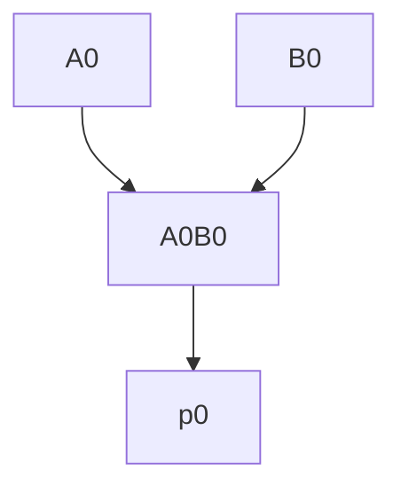

# FMA16
Floating point Multiply and Add. Implemented in 16 bit. Will first complete in C, then will complete in SystemVerilog.

```mermaid
flowchart TD;
   
    A0-->A0B0;
    B0-->A0B0;
    A0B0-->p0;
    
```
